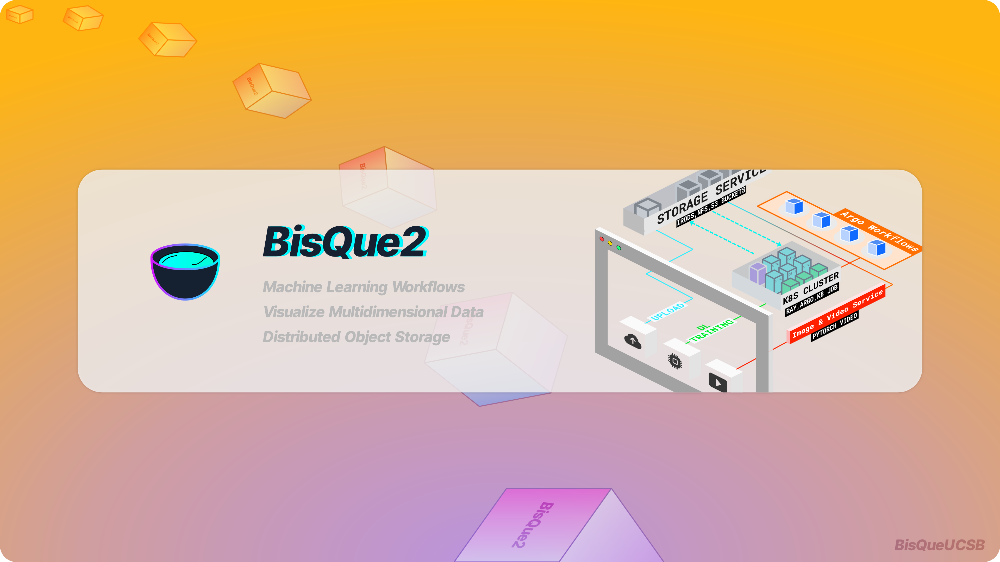
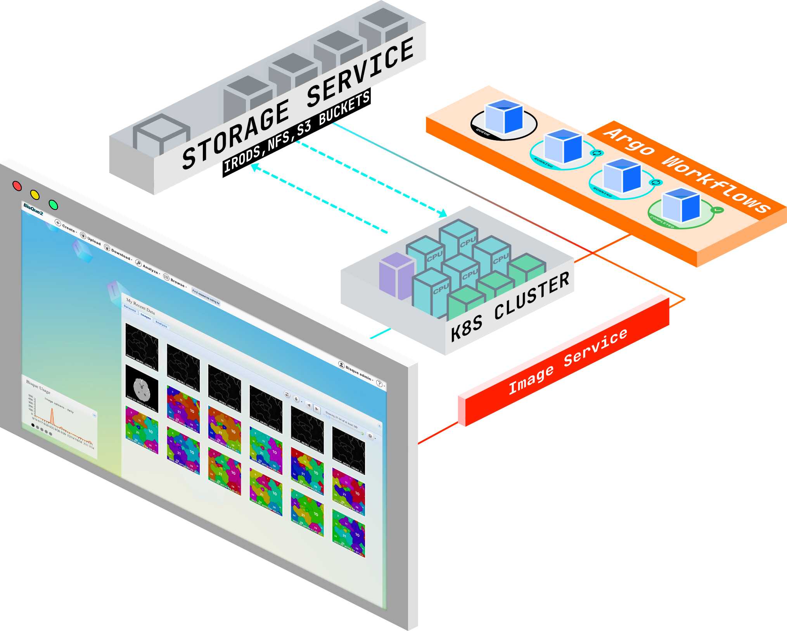

# Welcome

## Welcome to Official BisQue Documentation

<figure><figcaption></figcaption></figure>

## What is BisQue

[BisQue](https://bisque2.ece.ucsb.edu/client\_service/) is an open-source web-based platform that supports **data storage for petabytes, ML based data analysis and reproducible workflows**, and **visualization**.

<figure><figcaption></figcaption></figure>

BisQue is specifically designed to provide researchers with organizational and quantitative analysis tools for up to 5D image data. Users can extend BisQue by creating their own modules that take advantage of cutting edge machine learning algorithms. BisQue’s extensibility stems from two core concepts: an open web-based architecture and a flexible metadata facility. Together, these empower researchers to create, develop, and share novel multi-modal data analyses.

<figure><figcaption></figcaption></figure>

### BisQue Service: Jump right in

Follow our handy guides to get started on the basics as quickly as possible:


[data-storage](bisque-service/data-storage/)



[visualization](bisque-service/visualization/)



[analysis](bisque-service/analysis/)


## Developers

**Deploy** your own instance of BisQue with `Docker` or `Kubernetes`, and **Build** your own module using our BQ Module Generator Command Line Interface (CLI).


[installing-running-and-deploying-bisque.md](running-bisque-service/installing-running-and-deploying-bisque.md)



[docker-installation.md](running-bisque-service/docker-installation.md)



[install-python-bqapi.md](bisque-api/install-python-bqapi.md)


<figure><figcaption></figcaption></figure>
