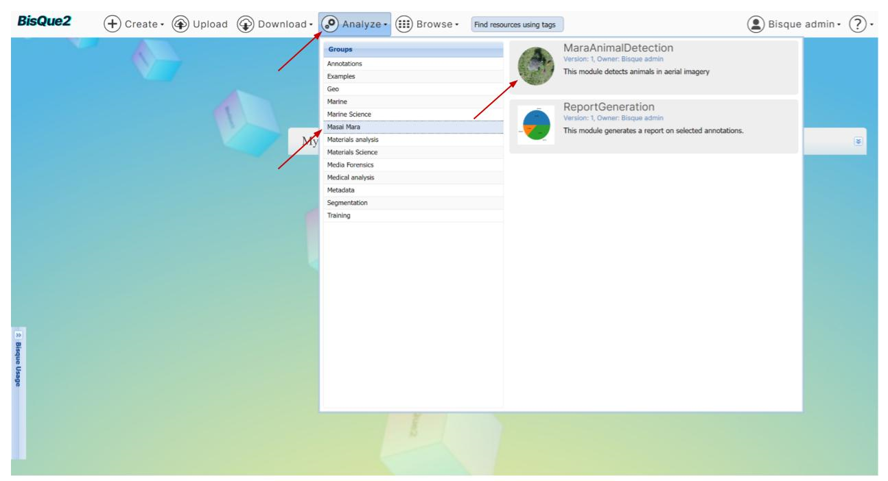
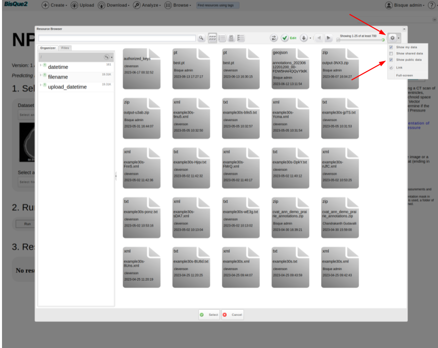
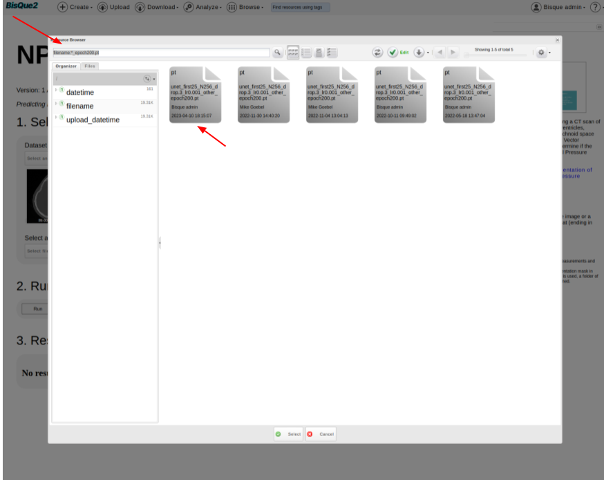
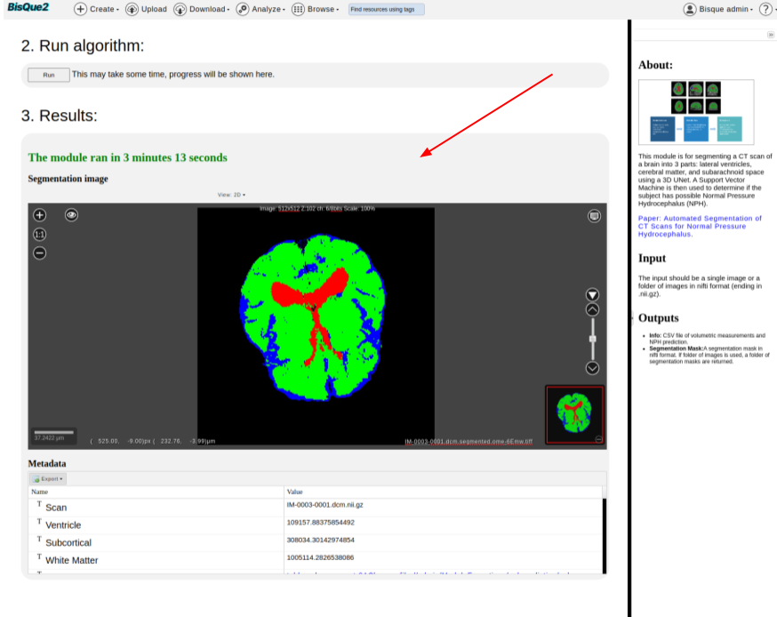

# iNPH Analysis

**Overview**

<figure><figcaption>
High level Overview of the Flow Chart
</figcaption></figure>

This study examines whether quantifiable changes can be detected in ventricular volume in Idiopathic Normal Pressure Hydrocephalus (iNPH) patients that undergo ventriculo-peritoneal shunt procedures.

**How to Run iNPH Analysis Module:**

#### STEP 1. Login

From the [BisQue Homepage](https://bisque2.ece.ucsb.edu/), the top right-hand corner has the **Sign In** button.

If you do not have an account, you can create one. If you already have an account, login using your credentials.

#### STEP 2. Upload Input Scans

BisQue supports many of the popular medical imaging file formats, i.e. `NIFTI`, `DICOM`.&#x20;

Here is the sample input image pair that is already present on BisQue.

* [Pre\_Scan.dcm](https://bisque2.ece.ucsb.edu/client\_service/view?resource=https://bisque2.ece.ucsb.edu/data\_service/00-F5GBk3yZsvSeZwDAf2PJXh)
* [Post\_Scan.dcm](https://bisque2.ece.ucsb.edu/client\_service/view?resource=https://bisque2.ece.ucsb.edu/data\_service/00-LeRtVAWHY2yXHQrQYefGGa)

One can test the module using the above pair, or use their own pair of scans as input.

#### STEP 3. Go To iNPH Analysis Module Homepage

Once you are logged in successfully, you can access the NPH Prediction module by [Clicking Here](https://bisque2.ece.ucsb.edu/module\_service/inphanalysis/?wpublic=1) or by using the Menu bar at the top of the homepage.

> **From the Menu Bar.** Using the Menu bar at the top of the screen, go to `Analyze --> Segmentation --> iNPH Analysis`. You might have to scroll down a little bit since we are adding more modules.\
> .png>)

#### STEP 4. Run iNPH Analysis Module

Once on the NPH Prediction homepage,

*   `Select an image` you uploaded.

    * Click on `Select an Image` Button under `Pre Scan` and `Post Scan`
    * It should navigate you to `Resource Browser`, where you should be able to select an image that is uploaded.
    * You should be able to see the selected images on the module page.

    > .png>)
*   Select a PyTorch Model, which is the magic box that is trained to predict the presence of iNPH by looking at the input scan.

    * Click on `Select file` button.
    * Cick on `Gear Icon` on top right corner of `Resource Browser`. Tick the box that corresponds to `Show public data`.

    > 

    * In the search bar, type `filename:*_epoch200.pt` and hit Enter. This should filter out the required pytorch files. Now, select the first model in the list and hit `Select`.

    > 
* Hit `RUN` Button.
* It is expected to take around 200 seconds to 500 seconds of runtime, depending upon the input file size, cluster compute availability, and various other factors.
*   Visualize the `Results`

    > 
* One can export the data into a CSV or XML file as well.

##
