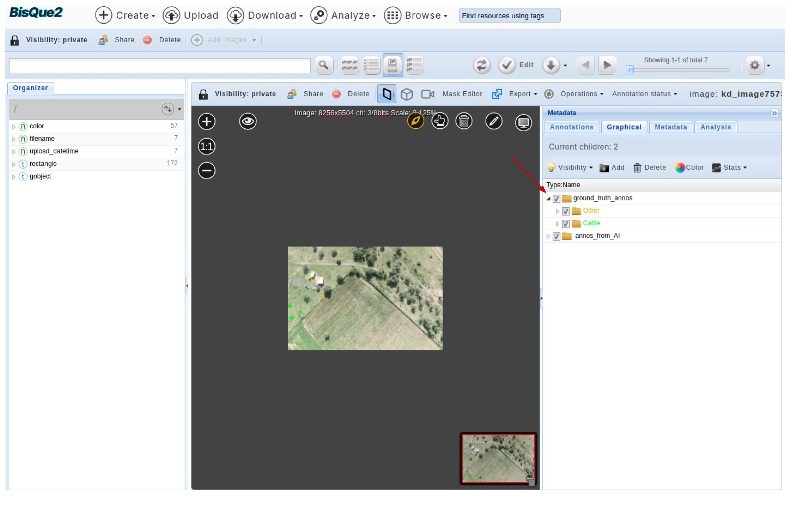

# Mara Animal Annotator

This page describes how one can run the BisQue Module named `Mara Animal Annotator`

## Run Instructions

This module takes in an image or a dataset of images, along with a text file containing the annotations that correspong to input dataset. It tags the bounding boxes in text file to input images as Graphical Objects (commonly referred to as G-Objects in BisQue).

### Navigate to Module Page

[Login](../../login-signup.md) >> Analyze >> `Mara Animal Annotator`

### Expected Inputs

* An image or a dataset of images
  * [Click here](https://bisque2.ece.ucsb.edu/client\_service/view?resource=https://bisque2.ece.ucsb.edu/data\_service/00-wzri2GdPGYauPHxA2KimU6) for a sample dataset of input images
* Annotation File
  * [Click here](https://bisque2.ece.ucsb.edu/client\_service/view?resource=https://bisque2.ece.ucsb.edu/data\_service/00-EJkQEpynxcU6rXtJG2RrcG) for a sample model file
* Annotation Name
  * This can be any string that can be used to name the annotations that are going to be tagged as inputs (for example, `ground_truth_annos`).

<figure><figcaption></figcaption></figure>

### Expected Outputs

* Annotations added to the image as G-Objects

Once the module execution is completed, one can navigate to the input dataset to visualize the tagged annotations.

<figure><figcaption></figcaption></figure>
