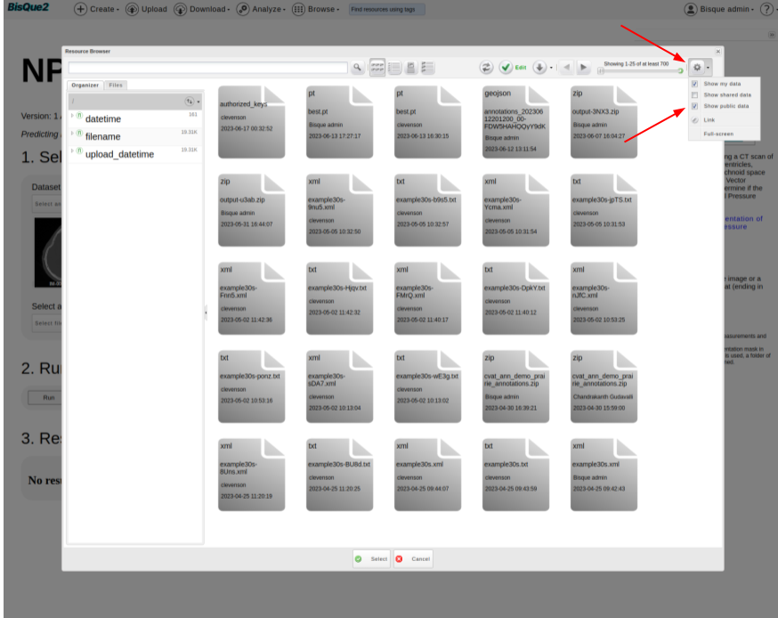
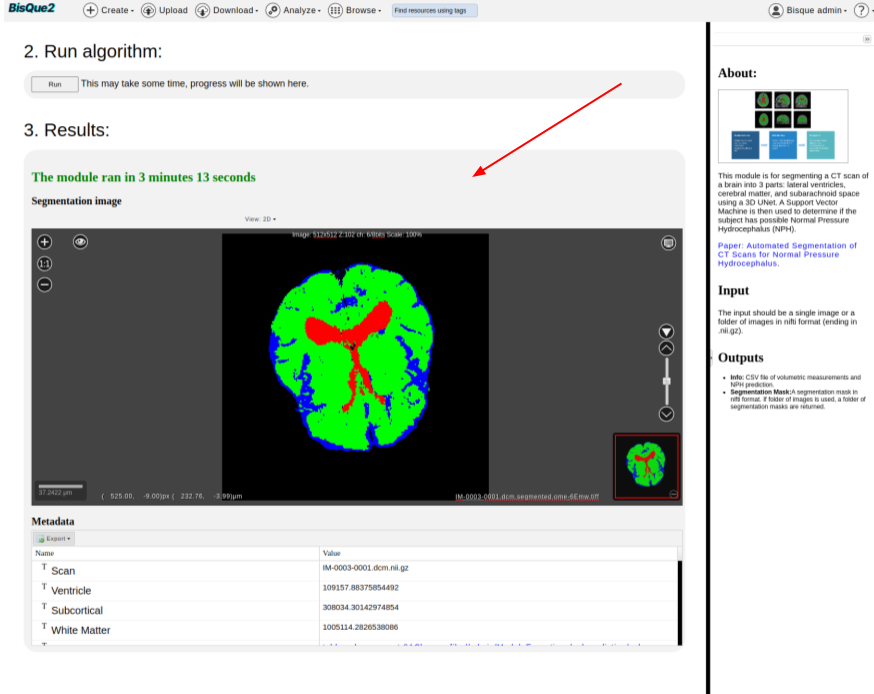

# NPH Prediction

## NPH Prediction using 3D UNET

#### Overview

This module is for segmenting a CT scan of a brain into 3 parts: lateral ventricles, cerebral matter, and subarachnoid space using a 3D UNet. A Support Vector Machine is then used to determine if the subject has possible Normal Pressure Hydrocephalus (NPH).


**How to Run NPH Prediction Module:**

### STEP 1. Login

From the [BisQue Homepage](https://bisque2.ece.ucsb.edu/), the top right-hand corner has the **Sign In** button.

If you do not have an account, you can create one. If you already have an account, login using your credentials.

### STEP 2. Upload Image(s)

BisQue supports many of the popular medical imaging file formats, i.e. `NIFTI`, `DICOM`. We will cover two of them here.

#### **Upload `NIFTI`**

Once logged in successfully, you will see **Upload** in the top menu bar. Click on **Upload** and feel free to **Drag-and-Drop** files or Select **Choose Files** or **Choose Directory**. Navigate to the `NIFTI` files on your computer and select the ones you want to upload, either individual files or an entire folder/directory.


**File Formats**

The supported `NIFTI` file types should end with `.nii` or `.nii.gz`


#### Example

```
CT35000.nii.gz
CT36000.nii
YOUR-FILENAME.nii.gz
```

**Upload `DICOM`**

Once logged in successfully, you will see **Upload** in the top menu bar. Click on **Upload** and feel free to **Drag-and-Drop** files or Select **Choose Files** or **Choose Directory**.


**WARNING: DICOM FILES MUST BE ZIPPED!**&#x20;

Before uploading your folder of `DICOM` files, make sure they are compressed/zipped. On Mac, two-finger click on the file and hit **Compress `YOUR-FOLDERNAME`**. This will zip the folder and allow you to upload that single zipped file to BisQue. _We currently do not support uploading the raw directory to BisQue._


#### Example

Folder of Raw `DICOM`.

```
IM-0001-0001-0001.dcm
IM-0001-0001-0002.dcm
IM-0002-0001.dcm
IM-0002-0002.dcm
IM-0002-0003.dcm
IM-0002-0004.dcm
IM-0002-0005.dcm
IM-0002-0006.dcm
IM-0002-0007.dcm
IM-0002-0008.dcm
IM-0002-0009.dcm
IM-0002-0010.dcm
IM-0002-0011.dcm
IM-0002-0012.dcm
IM-0002-0013.dcm
[...]
```

Zip the folder containing these files and you are good to go!

Select the option that says **Several DICOM files in a package (unpack and inspect)**. BisQue will correctly parse the `DICOM` files and upload them as dataset if there are multiple images. After its uploaded, you can click on the **Blue Text** to be taken to your uploaded files.

### STEP 3. Go To NPH Prediction Module Homepage

Once you are logged in successfully, you can access the NPH Prediction module by [Clicking Here](https://bisque.ece.ucsb.edu/module\_service/nphprediction/?wpublic=1) or by using the Menu bar at the top of the homepage.

> **From the Menu Bar.** Using the Menu bar at the top of the screen, go to `Analyze --> NPH Prediction`. You might have to scroll down a little bit since we are adding more modules.
> <figure><figcaption></figcaption></figure>


### STEP 4. Run NPH Prediction Module

Once on the NPH Prediction homepage,

* `Select an image` you uploaded.
    * Click on `Select an Image` Button
    * It should navigate you to `Resource Browser`, where you should be able to select an image that is uploaded.
    * You should be able to see the selected image on the module page.
    > <figure><figcaption></figcaption></figure>
* Select a PyTorch Model, which is the magic box that is trained to predict the presence of NPH by looking at the input scan.
    * Click on `Select file` button.
    * Cick on `Gear Icon` on top right corner of `Resource Browser`. Tick the box that corresponds to `Show public data`.
    > <figure><figcaption></figcaption></
    * In the search bar, type `filename:*_epoch200.pt` and hit Enter. This should filter out the required pytorch files. Now, select the first model in the list and hit `Select`.
    > <figure><figcaption></figcaption></

* Hit `RUN` Button.

* It is expected to take around 60 seconds to 300 seconds of runtime, depending upon the input file size, cluster compute availability, and various other factors.

* Visualize the `Results`

    > <figure><figcaption></figcaption></

* Instead of an image, one can also run the module on `dataset` of images. 
    * Users just need to upload the images to `dataset`.
    * That `dataset` can be used as an input.
    * Users need to just click on `Select a set of images` intead of `Select an image` button.

# Mask Editing

BisQue can also let users make **corrections** to masks predicted by the NPH model.

In this user manual, we present a toy example illustrating how one can make edits to the predicted mask.

### Step A: Open Predicted Mask
* Go to [Bique home page](https://bisque2.ece.ucsb.edu/client_service) and click on images
* Select the mask that was generated recently.
    > <figure><figcaption></figcaption></

* You should see a mask editor button at the top.
    > <figure><figcaption></figcaption></

* Click on that button. This should enable you to edit the mask.
* As a fun example, you can go to slice-3 and draw “three” on it. You can save the edited mask.
    > <figure><figcaption></figcaption></
* Click on “Save and Quit” Button. The edited mask should be saved on bisque (with a name that is different from the original mask). Users might have to wait for **20 seconds** and edited mask (with modified name) should be displayed on the screen.
* One can click on the 3D-Viewer and verify the edits (in this case).
    > <figure><figcaption></figcaption></

* Happy Editing!
