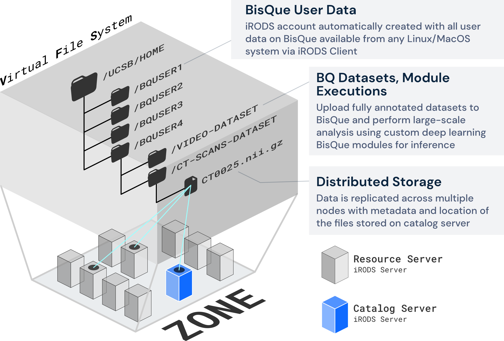

# Data Storage

## BisQue Storage System

<figure><figcaption></figcaption></figure>

* Storage integration to BisQue via a Kubernetes Storage Driver (iRODS CSI Driver)
* CSI Driver provides transparent data access to iRODS in BisQue
* iRODS rules to register iRODS data added via iRODS clients to Bisque, automatically
* Integrated SFTP service to iRODS (SFTPGo for iRODS) for convenient data access
* Command-line tool for iRODS data access (Gocommands) for access to large-scale datasets.
