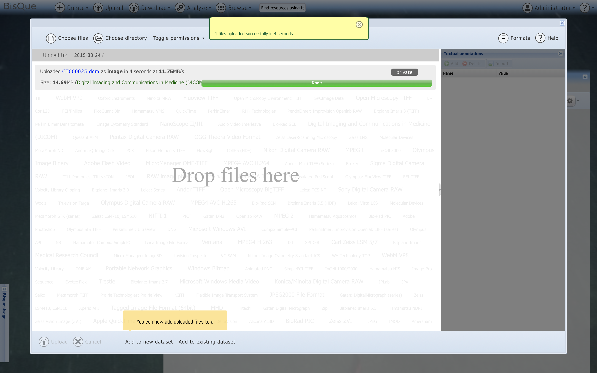
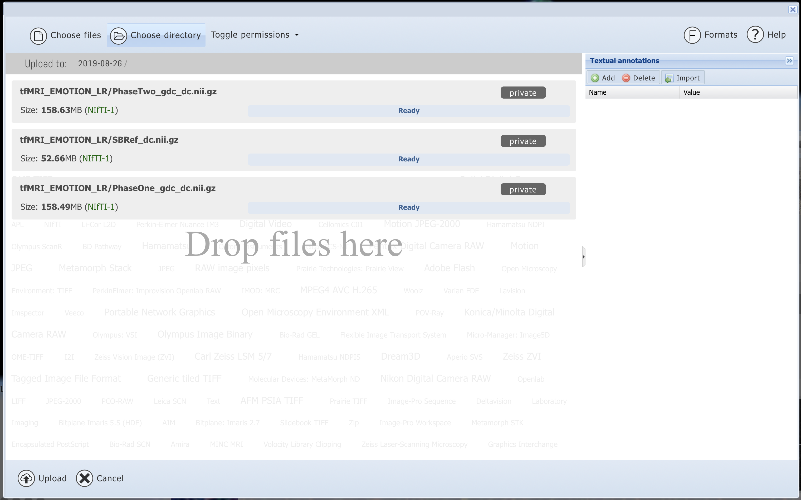
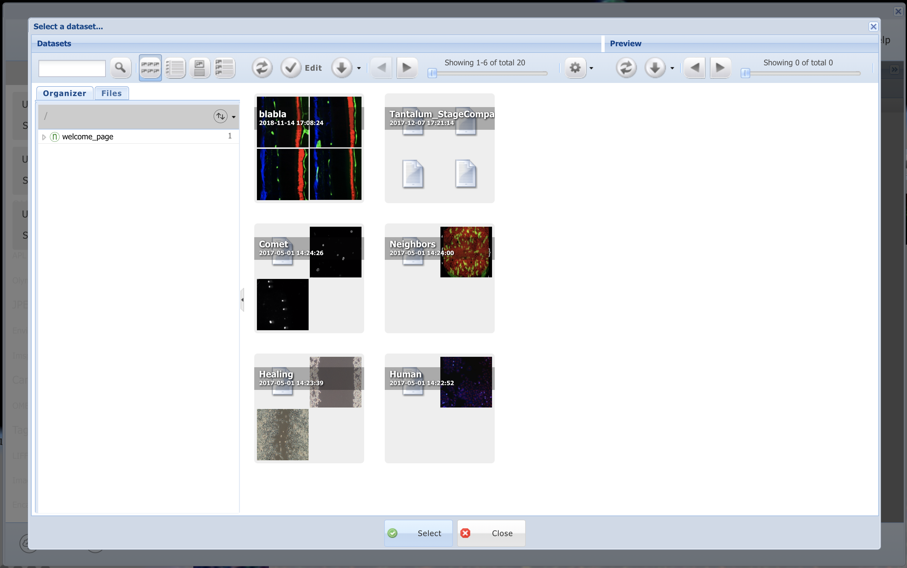
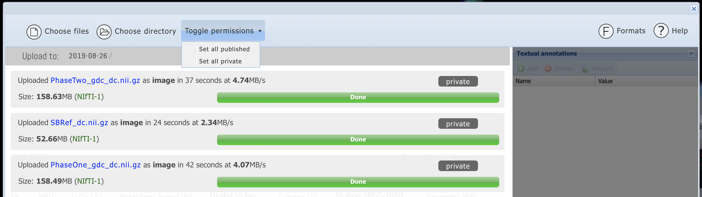

# Upload Data to BisQue

## Uploading Data to BisQue Service

<figure><figcaption></figcaption></figure>

### Step 1. Login&#x20;

Make sure you are logged in. If you are logged in, the MENU bar will include **Upload**.

### Step 2. Upload File or Folder&#x20;

Click **Upload** from the toolbar. There will be two options: **Choose File** or **Choose Directory**.

<figure><figcaption></figcaption></figure>

### Step 3. Build a Dataset&#x20;

Selecting **Choose Directory** will upload _all_ files in that directory. For example, we selected a folder with three NIFTI files.

Once the upload is finished, there will be two options to create a new dataset or add to an existing dataset.



If we choose to **Add a New Dataset**, this means we will create a new dataset with these three files we uploaded. We can always add new data to this dataset later.



If we choose **Add to Existing Dataset**, this means we will add these three NIFTI files to an existing dataset on BisQue. We are prompted with all of the datasets we have access to on BisQue: Datasets _we_ created and Datasets other _users_ have created but have made public.

<figure><figcaption>
Add uploaded data to an existing dataset.
</figcaption></figure>



### Step 4. Setting Permissions&#x20;

Once we have uploaded the data, we can set permissions for who can access our data. By default, everything is uploaded as **Private**. If we want to make our data publically available, we can **Toggle Permissions**.

<figure><figcaption></figcaption></figure>
