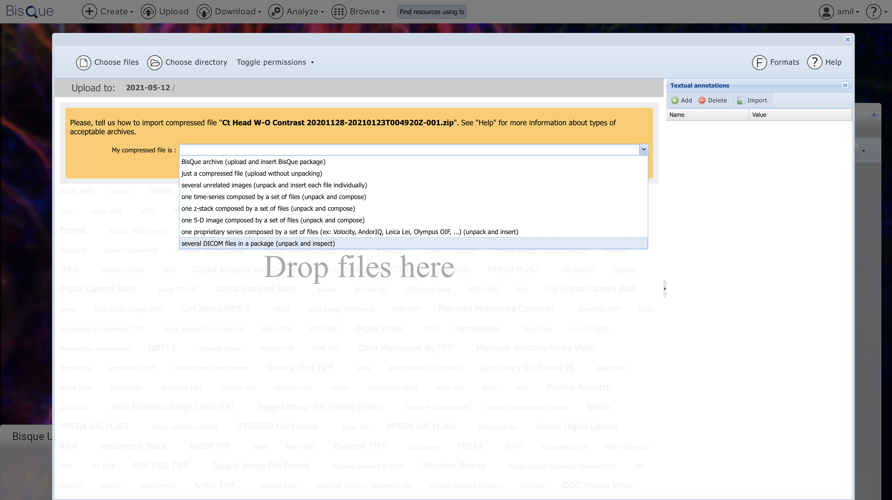

# Upload DICOMs

## Uploading DICOMs to BisQue

Once logged in successfully, you will see **Upload** in the top menu bar. Click on **Upload** and feel free to **Drag-and-Drop** files or Select **Choose Files** or **Choose Directory**.


**WARNING: DICOM FILES MUST BE ZIPPED!** \
Before uploading your folder of `DICOM` files, make sure they are compressed/zipped. On Mac, two-finger click on the file and hit **Compress `YOUR-FOLDERNAME`**. This will zip the folder and allow you to upload that single zipped file to BisQue. We currently do not support uploading the raw directory to BisQue.


### _Optional: Preparing DICOM Data_

_**Example**_ Folder of Raw `DICOM`.

```
IM-0001-0001-0001.dcm
IM-0001-0001-0002.dcm
IM-0002-0001.dcm
IM-0002-0002.dcm
IM-0002-0003.dcm
IM-0002-0004.dcm
IM-0002-0005.dcm
IM-0002-0006.dcm
IM-0002-0007.dcm
IM-0002-0008.dcm
IM-0002-0009.dcm
IM-0002-0010.dcm
IM-0002-0011.dcm
IM-0002-0012.dcm
IM-0002-0013.dcm
[...]
```

Zip the folder containing these files and you are good to go!

### Upload Zipped DICOM File

Select the option that says **Several DICOM files in a package (unpack and inspect)**. BisQue will correctly parse the `DICOM` files and upload them as dataset if there are multiple images. After its uploaded, you can click on the <mark style="color:blue;">**Blue Text**</mark> to be taken to your uploaded files.

<figure><figcaption></figcaption></figure>
