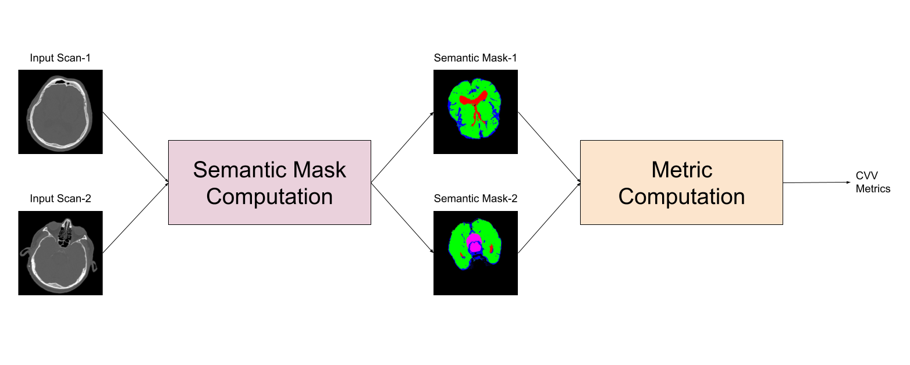

# 3D Materials

This page gives a brief overview of how users can access and visualize 3D Material Science Data.

## Dataset Navigation

* Go to [BsiQue Homepage](https://bisque2.ece.ucsb.edu/)
* Click on `Featured Datasets`
* Click on `Materials Science`

<figure><figcaption></figcaption></figure>

* Navigate to dataset named `Ti64_10_8_2012_HT2`

<figure><figcaption></figcaption></figure>

## Visualization of 3D Microstructures

* Click on file named `Ti_64_equiaxed_6_15_2017_final.dream3d`
* On the left panel, Navigate to `DataContainers` >> `ImageDataContainer` >> `CellData` >> `IPFColor`.

.jpg>)

* Click on `3D Volume Renderer`

.jpg>)

* Hover mouse to get the feel of 3D Visualization.

<figure><figcaption></figcaption></figure>

For more details about the dataset, please refer to our paper titled [Titanium 3D Microstructure for Physics-based Generative Models: A Dataset and Primer](https://vision.ece.ucsb.edu/abstract/794).

