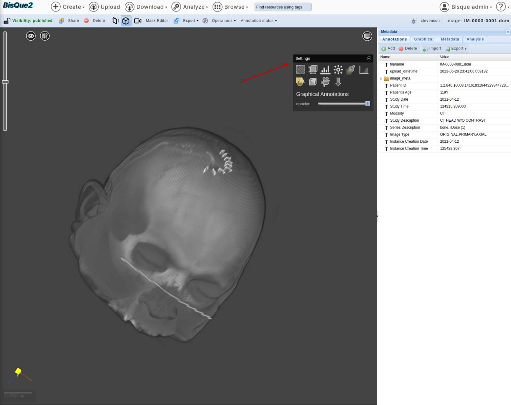
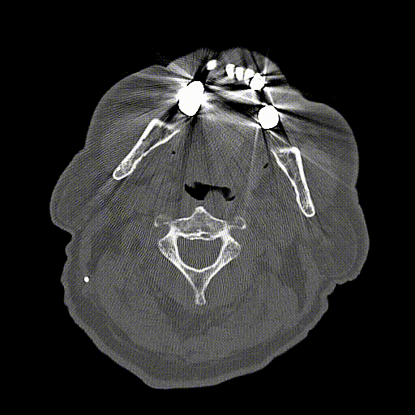

# Brain CT Scans

This page shows different ways to visualize Brain CT Scan Images.

## Sample Files

Brain CT scans are typically available as DICOM (.dcm) files or NII (.nii.gz) files.

* [Sample DICOM file - 1](https://bisque2.ece.ucsb.edu/client\_service/view?resource=https://bisque2.ece.ucsb.edu/data\_service/00-syvRY9kUHpbNRA7vwMbvRh)
* [Sample DICOM file - 2](https://bisque2.ece.ucsb.edu/client\_service/view?resource=https://bisque2.ece.ucsb.edu/data\_service/00-WWQbMTvD82RQUQYn8N3XuE)
* [Sample NII file](https://bisque2.ece.ucsb.edu/client\_service/view?resource=https://bisque2.ece.ucsb.edu/data\_service/00-xzAMZ2J4gmSHZreanEMwMD)

Rest of the page is illustrated using this [DICOM file](https://bisque2.ece.ucsb.edu/client\_service/view?resource=https://bisque2.ece.ucsb.edu/data\_service/00-syvRY9kUHpbNRA7vwMbvRh).

## View in 2D Tiled Viewer

This is the default viewer of BisQue.

<figure><figcaption></figcaption></figure>

* Traverse over depth (Z-axes) using the buttons in the bottom right corner.

<figure><figcaption></figcaption></figure>

* Other filters to visualization, such as, contrast enhancement, can be adjusted using the buttons in top left corner.

<figure><figcaption></figcaption></figure>

## View in 3D Volume  Renderer

Navigate to 3D Volume Renderer. (It might take couple of seconds to load.)

<figure><figcaption></figcaption></figure>

Right click and move mouse to get a feel of it.

<figure><figcaption></figcaption></figure>

Play around with the self explanatory options on top right corner.

<figure><figcaption></figcaption></figure>

## View as a Movie

* Go to `Movie` mode

.png>)

* Hit Play, at bottom left corner.

<figure><figcaption></figcaption></figure>

Hope this helps!

